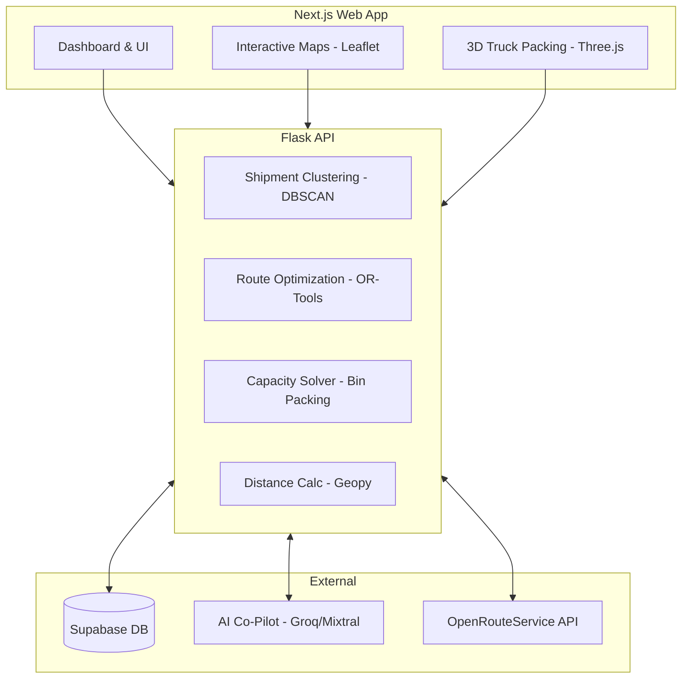

<div align="center">

# 🚚 LORRI
**AI-Powered Load Consolidation & Optimization Engine**

[](https://nextjs.org/)
[](https://python.org)
[](https://flask.palletsprojects.com/)
[](https://supabase.com/)
[](https://opensource.org/licenses/MIT)

*Built with ❤️ by **Team Escape Velocity***

[Features](#-features) • [How it Works](#-how-it-works) • [Tech Stack](#️-tech-stack) • [Installation](#-getting-started) • [Impact](#-expected-impact)

</div>

---

## 🚀 Overview

**LORRI** (Load Optimization and Route Reduction Intelligence) is an intelligent logistics and freight optimization platform. It dynamically consolidates shipments, maximizes vehicle capacity, and constructs highly efficient transport routes—significantly reducing transportation costs and carbon emissions.

Designed for modern supply chains, LORRI combines **Machine Learning (Clustering)**, **Operations Research (Vehicle Routing & Bin Packing)**, and **Interactive 3D Visualization** into a seamless dashboard powered by an **AI Logistics Co-Pilot**.

---

## ✨ Features

### 📦 Intelligent Shipment Consolidation
Utilizes machine learning (`DBSCAN`) to automatically identify and group nearby shipments that can logically be transported together, drastically improving freight density and vehicle utilization.

### 🚛 3D Vehicle Capacity Optimization (Bin Packing)
Integrates **Google OR-Tools** to perform 3D bin packing calculations. Lorri determines the absolute best way to orient and pack boxes into standard trucks and containers, minimizing "shipping air" and maximizing payload.

### 🧭 Route Optimization & VRP
Solves the complex **Vehicle Routing Problem (VRP)** to establish the fastest, most fuel-efficient delivery sequences. Lorri factors in multi-stop drop-offs, geographic clustering, and vehicle constraints.

### 🗺️ Interactive Logistics Map
A beautiful, highly interactive map powered by `Leaflet` and `OpenStreetMap`. Visualize hubs, drop-off locations, live routes, and consolidated corridors in real-time.

### 🎮 3D Load Visualization (Unique Selling Proposition)
Before a box is even lifted, managers can view a **3D interactive simulation** (built with `Three.js`) of how the truck needs to be loaded. Spin, pan, and verify the physical packing plan.

### 🤖 AI Logistics Co-Pilot
Why click through menus when you can converse with your data? Lorri features an embedded LLM Co-Pilot (powered by `Mixtral/Groq`) that understands logistics context:
> *"Which shipments can be consolidated on the Mumbai-Pune corridor today?"*
> *"Show me underutilized trucks departing from Delhi."*
> *"Calculate our carbon savings for the last 5 days."*

### 🌱 Embedded Carbon Tracking
Automatically tracks estimated Scope 3 emissions based on distance, payload, and fuel logic, empowering companies to validate exactly how much carbon they saved through consolidation.

---

## 🧠 How It Works

1. **Ingestion:** Upload real-world shipment data (Origin, Destination, Volume, Weight, Deadlines).
2. **Clustering:** LORRI's ML models group localized deliveries to form initial "clusters" of freight.
3. **Bin Packing:** The engine calculates exactly which vehicle sizes are needed, virtually "packing" items to ensure volume and weight constraints aren't exceeded.
4. **Routing:** Optimized routing sequences are generated for the assigned vehicles.
5. **Action:** Shippers view the interactive 3D plan, review routes on the map, and dispatch confidently.

---

## 🏗️ System Architecture



---

## ⚙️ Tech Stack

### **Frontend**
*   **Framework:** Next.js 14, React 19
*   **Styling:** Tailwind CSS, shadcn/ui, Framer Motion
*   **Mapping:** Leaflet, React-Leaflet
*   **3D Visualization:** Three.js, React-Three-Fiber
*   **Data Vis:** Recharts
*   **Backend as a Service:** Supabase (Auth & Realtime DB)

### **Backend**
*   **Framework:** Python Flask
*   **Optimization Engine:** Google OR-Tools, scipy.optimize
*   **Machine Learning:** scikit-learn (DBSCAN), Pandas, Numpy
*   **Geospatial / Routing:** Geopy, OpenRouteService API
*   **AI Agent:** Groq (Mixtral 8x7B / Llama 3)
*   **Utilities:** ReportLab (PDFs), OpenPyXL, Requests

---

## 🚀 Getting Started

Follow these instructions to get a local copy of LORRI up and running.

### Prerequisites
*   Node.js (v18+)
*   Python (3.10+)
*   Supabase Account (Free tier)
*   API Keys for OpenRouteService and Groq

### Installation

**1. Clone the repository**
```bash
git clone https://github.com/your-username/TeamEscapeVelocity_AILoadConsolidationOptimizationEngine.git
cd TeamEscapeVelocity_AILoadConsolidationOptimizationEngine
```

**2. Setup Backend**
```bash
cd backend
python -m venv venv
# On Windows: venv\Scripts\activate
# On Mac/Linux: source venv/bin/activate
pip install -r requirements.txt
```
*Create a `.env` file in the `backend` directory referencing `.env.example`.*
```bash
python run.py # Starts Flask on http://127.0.0.1:5000
```

**3. Setup Frontend**
```bash
cd ../frontend
npm install
```
*Create a `.env.local` file in the frontend root with your Supabase credentials.*
```bash
npm run dev # Starts Next.js on http://localhost:3000
```

---

## 📊 Expected Impact

By utilizing LORRI's intelligent algorithms, logistics providers can typically expect:

| Metric | Estimated Improvement |
| :--- | :--- |
| **Vehicle Utilization** | 📈 +30% to +40% |
| **Overall Freight Cost** | 📉 -20% to -30% |
| **Deadheading / Empty Miles**| 📉 -35% |
| **Carbon Emissions** | 📉 -25% |

---

## 👥 Meet Team Escape Velocity

LORRI was ideated and developed with ❤️ under strict prototyping constraints by **Team Escape Velocity**:

*   **Vedant Deore**: Frontend Architecture, Map System, Core Routing & AI Copilot Integration
*   **Ritesh Sakhare**: Feature Ideation, System Architecture & Database Engineering
*   **Samyak Raka**: UI/UX Design, Aesthetics & Component Assembly
*   **Satyajit Shinde**: 3D Loading Simulation System & Three.js Architecture

---

## 📄 License & Acknowledgments

This project is licensed under the MIT License - see the `LICENSE` file for details.

*   Algorithms powered by [Google OR-Tools](https://developers.google.com/optimization).
*   Routing data supported by [OpenRouteService](https://openrouteservice.org/).
*   Inference by [Groq](https://groq.com/).
